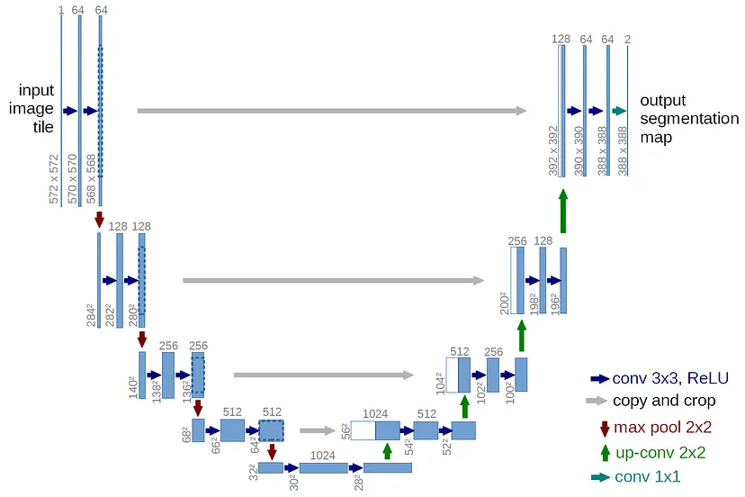
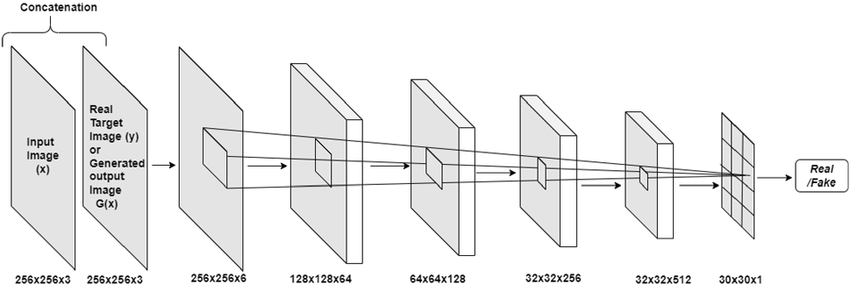
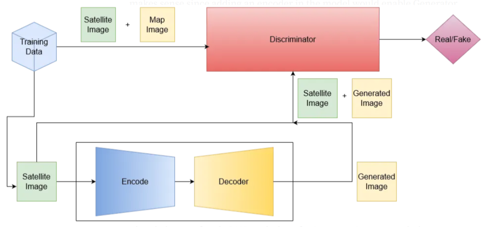

# Drishti - A Pix2Pix GAN Model 

Drishti is a deep learning-based AI tool that transforms SAR (Synthetic Aperture Radar) images into optical-like images, making complex radar data human-readable.

---

## Introduction

This project aims to develop an advanced system that uses pix2pix **GAN (Generative Adversarial Network)**. This model will address challenges in understanding **SAR (Synthetic Aperture RADAR)**. It converts SAR images captured by satellite to optical images, making it easier for non-experts to interpret and analyze satellite data. This approach can be valuable for applications in remote sensing, disaster monitoring, and environmental analysis.

---

## Goals

-  **SAR-to-Optical Translation** – Convert SAR images into optical images.

-  **High-Quality Image Generation** – Generate realistic and coherent optical images using Pix2Pix GAN. 

-  **User-Friendly Interface** – Provide an intuitive Streamlit interface to upload SAR images and view generated results.  

---

## Features

- Upload SAR images and generate optical images instantly.  
- High-quality image translation with Pix2Pix GAN.  
- Easy-to-use interface using Streamlit.  
- Supports deployment on standard CPU/GPU hardware.  

---

## Architecture

### 1. Generator


### 2. Discriminator


### 3. Generative Adversarial Network


---
## Loss Functions Used

| Component      | Loss Function Used                        | Purpose                                                                 |
|----------------|------------------------------------------|-------------------------------------------------------------------------|
| Generator (G)  | `L1 Loss + Adversarial Loss (BCE)`       | Encourages generator to produce realistic optical images close to target. |
| Discriminator (D) | `Binary Cross-Entropy (BCE) Loss`       | Helps discriminator distinguish real vs fake images.                    |


---

## Installation

1. Clone the repository:

    ```bash
    git clone https://github.com/roshan-acharya/Drishti
    cd Drishti
    ```
2. Install dependencies:

    ```bash
    pip install -r requirements.txt
    ```

3. Run the Streamlit application:

    ```bash
    streamlit run app.py
    ```
---
## Collaborators
<table> <tr> <td align="center"> <a href="https://github.com/roshan-acharya">  <br /> <sub><b>Roshan Acharya</b></sub> </a> </td> <td align="center"> <a href="https://github.com/lovelessbhartal12">  <br /> <sub><b>Loblesh Bhartal</b></sub> </a> </td>  </table>

---

## References / Citations

For further reference and proper attribution, please cite:

1. **Pix2Pix GAN (Paper)**  
   Phillip Isola, Jun-Yan Zhu, Tinghui Zhou, Alexei A. Efros.  
   *Image-to-Image Translation with Conditional Adversarial Networks*, CVPR 2017.  
   [PDF](https://arxiv.org/abs/1611.07004)

2. **Medium Article**  
   *Pix2Pix GAN for Generating Map Given Satellite Images Using PyTorch*  
   [Medium Article Link](https://medium.com/@Skpd/pix2pix-gan-for-generating-map-given-satellite-images-using-pytorch-6e50c318673a)
